# Mr T's Pies 

**Developer: Kieran Merrett**

💻 [Visit live website](https://mrtspies.herokuapp.com/)  
(Ctrl + click to open in new tab)

## Table of Contents
  - [About](#about)
  - [User Goals](#user-goals)
  - [Site Owner Goals](#site-owner-goals)
  - [User Experience](#user-experience)
  - [User Stories](#user-stories)
  - [Design](#design)
    - [Colours](#colours)
    - [Fonts](#fonts)
    - [Structure](#structure)
      - [Website pages](#website-pages)
      - [Database](#database)
    - [Wireframes](#wireframes)
  - [Technologies Used](#technologies-used)
  - [Features](#features)
  - [Validation](#validation)
  - [Testing](#testing)
    - [Manual testing](#manual-testing)
    - [Automatic testing](#automatic-testing)
  - [Bugs](#bugs)
  - [Heroku Deployment](#heroku-deployment)
  - [Credits](#credits)
  - [Acknowledgements](#acknowledgements)

### About

Mr Ts Pies is a website designed to help promote a local pie making business, sharing recent news, advertise workshops and allow users to book onto a workshop of their choice.

### User Goals

- To promote the business and inform customers of areas we operate
- To view a list of current pies, news articles and upcoming workshops
- To be able to view edit and cancel workshop bookings

### Site Owner Goals

- To provide a solution to allow users to book onto a workshop
- To attract more business with a well crafted site
- Provide a modern application with an easy navigation
- Fully responsive and accessible

## User Experience

### Target Audience
- Users that wish to book a pie making workshop for themselves and friends
- Past and new customers for the business
- Tourists visiting the area that are looking for a cooking experience
- People wanting to find out more and learn more about the company

### User Requirements and Expectations

- Fully responsive
- Accessible
- A welcoming design
- Social media
- Contact information
- Accessibility

##### Back to [top](#table-of-contents)

## User Stories

### Users

1.	As a User i can navigate across the site so that I can move to each feature of the site easily
2.	As a User i can use a navbar, footer, and social icons so that I can navigate the site, access menus, and access socials
3.	As a User i can view the contact details so that I know how to contact them via email, phone and socials
4.	As a User i can book onto an workshop so that i can reserve a space
5.	As a User i can update my booking so that i can change the details on my booking
6.	As a User i can delete my booking so that i can free up space for someone else
7.	As a User i can view my booking so that i can check the details of the workshop
8.	As a User i can be notified of my action in creation, editing, or deleting of a booking so that i know it has been successful
9. As a User i can register for a new account so that i can make a booking at an event and leave comments
10. As a User i can log in to my account so that i can make a booking or leave comments
11. As a User i can see login status so that i know if i am logged in or not
12. As a User i can view the sites news articles so that I can learn more information, read articles
13. As a User i can Create Read and Delete my comments on articles so that i can connect with the site owner
15. As a User i can not book an event in the past so that my booking remains valid
16. As a User i can view news articles page-by-page so that the screen isn't crowded with information

28. As a User i can View a list of events so that I can choose which one i want to book onto
29. As a User i can hide past events so that I can NOT book an event in the past
31. As a User i can view events in pages so that the screen doesn't get blocked up with too many events

### Admin / Authorised User
17. As a Admin i can login so that i can access the back end of the site
18. As a Admin i can manually add a booking so that people can book onto an event in other ways
19. As a Admin i can accept or reject booking so that we avoid false bookings
23. As a Admin i can filter events by date so that I can see what events we have for a particular day
27. As a Site Admin i can create, update and delete events so that users can book onto them

### Site Owner  
24. As a Site Owner i can provide a fully responsive site for my customers so that they have a good user experience
25. As a Site Owner i can validate data entered into my site so that all submitted data is correct to avoid errors
26. As a Site Owner i can provide a contact us page so that users can get in touch with the business

### Kanban & User Stories
- GitHub Kanban was used to track all open user stories
- Backlog, In Progress, Done headings were used in the kanban

User Stories

Kanban

##### Back to [top](#table-of-contents)

## Design

### Colours

I chose dark colours, mainly black and white with other colours which are slight variations as the company colours are predominately black and white. I added in the colour orange to buttons to give it a warmer feeling and to add some modernness to it.

The colors I wanted to stay close to  [Coolors.co](https://coolors.co/)

See colour pallet

### Fonts

 The fonts selected were from Google Fonts, Roboto with sans-serif as a backup font.

### Structure

#### Website pages

The site was designed for the user to be familiar with the layout such as a navigation bar along the top of the pages and a hamburger menu button for smaller screen.

The footer contains all relevant social media links that the business has so the user can visit any social media site and follow the business there to expand the businesses followers, likes and shares.

- The site consists of the following pages:
  - Homepage with information about the 2 chefs, and also the current markets they operate at.
  - About:
    - About Us page to give the customer information about the company, how it came to be and more detailed information about where the pies are made and they source the ingredients.
    - News page where the user can find current articles written by the company to highlight their most current and up to date acheivements and things which may be happening in the business.
  - Pies page is where a list of all the pies the company make are displayed along with the ingredients and all associated allegies
  - Events:
    - Markets this section displays a list of the current markets they operate at, information about the area along with a Google map link to get directions straight to its location
    - Workshops here is displayed the up coming list of workshops the company are hosting along with available spaces should a visiting customer wish to sign up and book on.
  - Register is a page where the user can sign up to the website, this will allow them to be able to leave comments and likes on news articles, like pies and book onto workshops
  - Login / Logout here a authenticated user can choose to log into their profile or log out should they wish to.
  - Profile page is a area where the logged in user can read, update and delete any of their current and upcoming bookings.
  - Get In Touch this page is where the visiting customer can contact the business through a form or through a link to their Facebook Messenger or Whatsapp details
  - 404 error page to display if a 404 error is raised

#### Database

- Built with Python and the Django framework with a database of a Postgres for the deployed Heroku version(production)

Show diagram

##### User Model
The User Model contains the following:
- user_id
- password
- last_login
- is_superuser
- username
- first_name
- last_name
- email
- is_staff
- is_active
- date_joined

##### Workshop Model
The Workshop Model contains the following:
- title
- slug
- event_date
- spaces
- chef
- content
- featured_image
- excerpt
- created_on
- status
- likes

##### Booking Model
The Booking Model contains the following:
- user
- workshop
- name
- email
- phone_number
- spaces
- dietary_requirements
- booked_on
- approved

##### Article Model
The Article Model contains the following:
- title
- slug
- author
- content
- featured_image
- excerpt
- created_on
- status
- likes

##### Comment Model
The Comment Model contains the following:
- post
- name
- email
- body 
- created_on

##### Pie Model
The Pie Model contains the following:
- title
- slug
- description
- featured_image
- excerpt
- diet
- allergies
- likes

### Wireframes
The wireframes were created using Balsamiq

Images

Desktop

Tablet

Mobile

## Technologies Used

### Languages & Frameworks

- HTML
- CSS
- Javascript
- Python
- Django

### Libraries & Tools

- [Am I Responsive](http://ami.responsivedesign.is/)
- [Balsamiq](https://balsamiq.com/)
- [Bootstrap v5.2](https://getbootstrap.com/)
- [Cloudinary](https://cloudinary.com/)
- [dbdiagram.io](https://dbdiagram.io/)
- [Favicon.io](https://favicon.io)
- [Chrome dev tools](https://developers.google.com/web/tools/chrome-devtools/)
- [EmailJS](https://www.emailjs.com/)
- [Font Awesome](https://fontawesome.com/)
- [Git](https://git-scm.com/)
- [GitHub](https://github.com/)
- [Google Fonts](https://fonts.google.com/)
- [Heroku Platform](https://id.heroku.com/login)
- [jQuery](https://jquery.com)
- [ElephantSQL](https://www.elephantsql.com/)
- [Summernote](https://summernote.org/)
- Validation:
  - [WC3 Validator](https://validator.w3.org/)
  - [Jigsaw W3 Validator](https://jigsaw.w3.org/css-validator/)
  - [JShint](https://jshint.com/)
  - [Pycodestyle(PEP8)](https://pypi.org/project/pycodestyle/)
  - [Lighthouse](https://developers.google.com/web/tools/lighthouse/)
  - [Wave Validator](https://wave.webaim.org/)

##### Back to [top](#table-of-contents)

## Features

### Home page
- Home page includes nav bar, main body and a footer

See feature images

### Logo & Navigation
- Display business logo
- Fully Responsive
- On small screens switches to hamburger menu
- Indicates login/logout in status
- displayed on all pages

See feature images

### Footer
- Contains social media links
- displayed across all pages

See feature images

### About -> About Us
- This displays a picture of the owner and employees and a description of the business
  

See feature images

### About -> News
- The news displays each post made by a staff member
- Paginations is used to display 3 posts per page
- A 'read more' link is present to encourage the reader to read further into the article.
- Number of likes given to the post is displayed
- A section to allow logged in users to like or leave comments, prompted to signup or log in if not currently so
  

See feature images

### Comments
- Logged in users may leave comments on articles to communicate their thoughts about the article to the company owner.
- The user may delete their comment should they wish to and are notified to ensure this is the action they wish to take
  

See feature images

### Pies Menu
- The Pies page displays all the current pies sold by the company.
- All items are updated in the Admin panel by Staff and superusers ONLY
- Each Pie displays the details and also allows logged in users to like/unlike pies as they feel.
  

See feature images

### Events -> Markets
- Clicking this navigates to a lateral scrolling list of all markets the company currently do.
- Details of times and when they are there are also given
- A link to to a google location for each market is used by clicking the 'Visit Us' button.
- Map directions open in a seperate page
  

See feature images

### Events -> Workshops
- Here is displayed a current list of workshops the company offer and the number of available spaces, it is paginated by 4 to save overfilling the page.
- Users can click to get more detail and if logged in, book spaces for themselves
- If not logged in, users are directed to login or sign up to book on.
  

See feature images

### Booking
- Allow users to make a booking for a workshop
- Allows users to input their details and select dietary requirements
- redirected back to profile page following successful booking

See feature images

### Sign up / Register
- Allow users to register an acoount
- Username and password is required, email is optional

See feature images

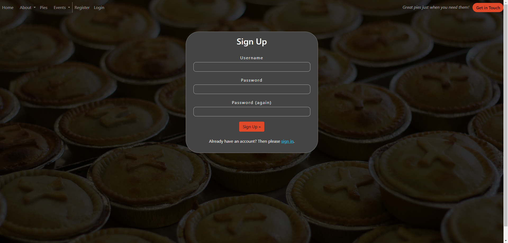

### Login
- User can login to book a workshop, view/edit and delete their bookings and leave likes and comments on the website
- On successful sign in, redirected to your profile page to see your bookings.

See feature images

### Logout
- Allows the user to securely log out
- Ask user if they are sure they want to log out

See feature images

### Profile Page
- Allow the users to view, edit and delete their bookings
- If user has no bookings, then a note is shown to inform them and ask them if they would like to look at workshops and make a booking.

See feature images

Profile Page

Edit Booking

Delete Booking

No Bookings

### Contact Us
- Using EmailJS, a contact form is presented to all people wishing to contact the business.
- other options include Whatsapp and Facebook Messenger
  

See feature images

### Social Media Links
- A logo and link is used for each social media displayed
- All links open in a new tab to ensure user is not directed away from the business
- Displayed on all pages
  

See feature images

##### Back to [top](#table-of-contents)

## Validation

The W3C Markup Validation Service

Home

base.html

index.html

About

about-us.html

news.html

news-detail.html

Pies

pies.html

Workshops

workshops.html

workshops-detail.html

Booking

booking-form.html

edit-booking.html

delete-booking.html

Account Pages

login.html

logout.html

register.html

Profile Page

profile-page.html

Contact

base.html

404

404.html

### CSS Validation
The W3C Jigsaw CSS Validation Service

Style.css

### JavaScript Validation
JSHint JS Validation Service

Script.js

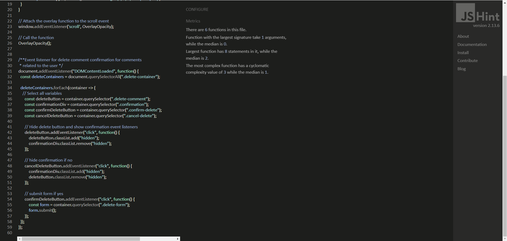

Alert.js

Contact.js

** One Undefined variable shown in the coding, however this is the tutorial followed on EmailJS website, with small modifications for my own styling **

[Walkthrough shown here](https://www.emailjs.com/docs/sdk/installation/)

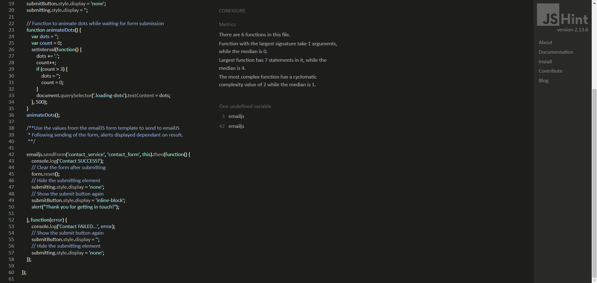

Reviews.js

### PEP8 Validation
[CI Python Linter](https://pep8ci.herokuapp.com/) to check  Python code for validity and conventions

Menu App

  

views.py

  
  

  

models.py

  
  

  

admin.py

  
  

  

urls.py

  
  

  

test_models.py

  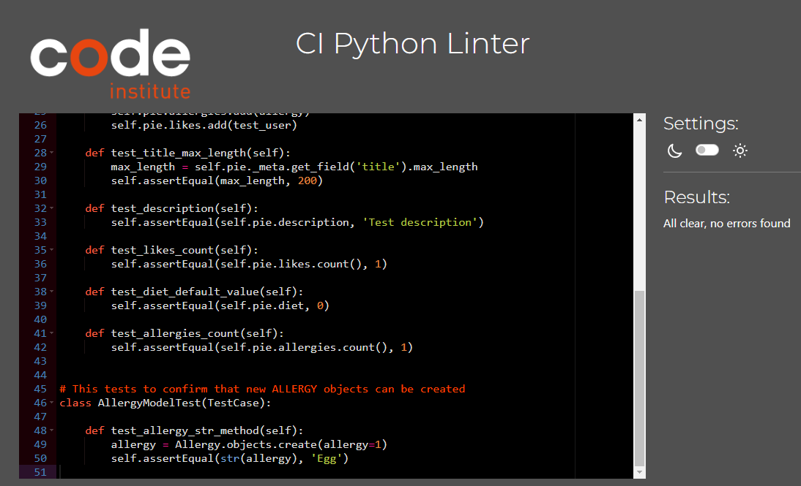
  

  

test_urls.py

  
  

  

test_views.py

  
  

  -
   

News App

  

views.py

  
  

  

models.py

  
  

  

admin.py

  
  

  

urls.py

  
  

  

forms.py

  
  

  

test_models.py

  
  

  

test_urls.py

  
  

  

test_views.py

  
  

  -
   
 

Workshops App

  

views.py

  
  

  

models.py

  
  

  

admin.py

  
  

  

urls.py

  
  

  

forms.py

  
  

  

test_models.py

  
  

  

test_urls.py

  
  

  

test_views.py

  
  

  -
   
 

### Lighthouse

Performance, best practices and SEO was tested using Lighthouse.

**I had alot of issues trying to get the lighthouse report on my computer, i had to seek help and get some screenshots sent over to me to show me the reports. Ended up with a complete mixture of results ranging in performance and mixed scores for the same page. I have attached both screenshots from my computer (light theme) and the ones sent to me (dark theme).
**Low performance score is due to the use of images and data being stored on third party hosting sites, images (Cloudinary) and data (elephantSQL) needing to be pulled to site.

See Lighthouse reports

Home

About Us

News

News/Detail

Pies

Workshops

Workshops/Detail

Booking

Login

Sign Up

Profile

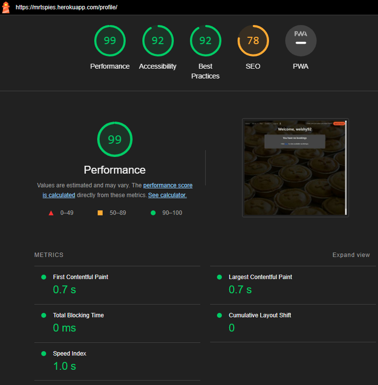

Contact

### Wave
WAVE was used to test the websites accessibility.

See WAVE reports

Home

About Us

News

News/Detail

Pies

Workshops

Workshops/Detail

Login

Sign Up

Profile

Contact

##### Back to [top](#table-of-contents)

## Testing

### Manual testing

1.	As a User i can navigate across the site so that I can move to each feature of the site easily 

**Step** | **Expected Result** | **Actual Result**
------------ | ------------ | ------------ |
| From the homepage use the naviagtion bar/menu to switch between pages | Be able to navigate between all areas of the website | Worked as expected |

Instructions

2.	As a User i can use a navbar, footer, and social icons so that I can navigate the site, access menus, and access socials

**Step** | **Expected Result** | **Actual Result**
------------ | ------------ | ------------ |
| From the homepage use the naviagtion bar/menu to switch between pages | Be able to navigate between all areas of the website | Worked as expected |
| Scroll to the bottom of the home page to navigate socials | Open social sites linked to the business | Worked as expected |

Instructions

Option 1

Option 2

3.	As a User i can view the contact details so that I know how to contact them via email, phone and socials

**Step** | **Expected Result** | **Actual Result**
------------ | ------------ | ------------ |
| Select 'Get in touch' from the navigation menu. Scroll to the bottom of the page. | Be shown all methods of contacting the company, email, phone, socials and alt forms of contact. Socials are displayed in the footer of each page | Worked as expected |

Instructions

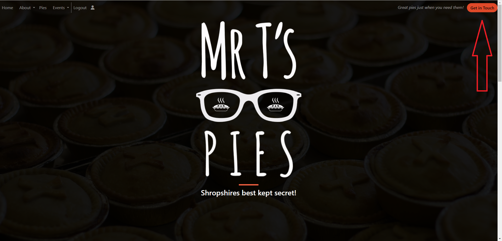

4.	As a User i can book onto an workshop so that i can reserve a space

**Step** | **Expected Result** | **Actual Result**
------------ | ------------ | ------------ |
| Once logged into your profile, navigate through 'Events' then into 'Workshops'. Select the workshop you wish to book onto. Enter the details and any specific dietary requirements before submitting. If valid booking, you are directed back to your profile page and shown that your booking is waiting approval. | Booking to be made for the user, pending approval | Worked as expected |

Instructions

5.	As a User i can update my booking so that i can change the details on my booking

**Step** | **Expected Result** | **Actual Result**
------------ | ------------ | ------------ |
| Once logged in, navigate to your profile page, click the pencil icon to edit your booking. Enter the new information and click save. | My booking to be updated with the new details | Worked as expected |

Instructions

6.	As a User i can delete my booking so that i can free up space for someone else

**Step** | **Expected Result** | **Actual Result**
------------ | ------------ | ------------ |
| Once logged in, navigate to your profile page, click the trash icon to delete your booking. When prompted to confirm deletion, click yes. | The booking to be deleted | Worked as expected |

Instructions

7.	As a User i can view my booking so that i can check the details of the workshop

**Step** | **Expected Result** | **Actual Result**
------------ | ------------ | ------------ |
| Once logged in, navigate to your profile to see a list of your bookings. Click the edit to see your booking in more detail | View the details of my booking | Worked as expected |

Instructions

8.	As a User i can be notified of my action in creation, editing, or deleting of a booking so that i know it has been successful

**Step** | **Expected Result** | **Actual Result**
------------ | ------------ | ------------ |
| Create, Update or Delete a current booking | Notification of the user action to be displayed | Worked as expected |

Instructions

9. As a User i can register for a new account so that i can make a booking at an event and leave comments

**Step** | **Expected Result** | **Actual Result**
------------ | ------------ | ------------ |
| From the home page click register in the navigation bar. Enter User details. | A new account to be created and navigated to the home page displaying notification your now logged in as that new user | Worked as expected |

Instructions

10. As a User i can log in to my account so that i can make a booking or leave comments

**Step** | **Expected Result** | **Actual Result**
------------ | ------------ | ------------ |
| From the home page click login in the navigation bar. Enter User details. | Logged into your account, notification to be displayed and directed to the home page | Worked as expected |

Instructions

11. As a User i can see login status so that i know if i am logged in or not

**Step** | **Expected Result** | **Actual Result**
------------ | ------------ | ------------ |
| Navigate to the home page | See in the navigation bar an option to either 'register/login' or to 'logout' depending on login status | Worked as expected |

Instructions

12. As a User i can view the sites news articles so that I can learn more information, read articles

**Step** | **Expected Result** | **Actual Result** 
------------ | ------------ | ------------ |
| From the home page, navigate to 'About' drop down then click 'News'. | A list of news articles relted to the company to be displayed with the option to read each article in more detail | Worked as expected |

Instructions

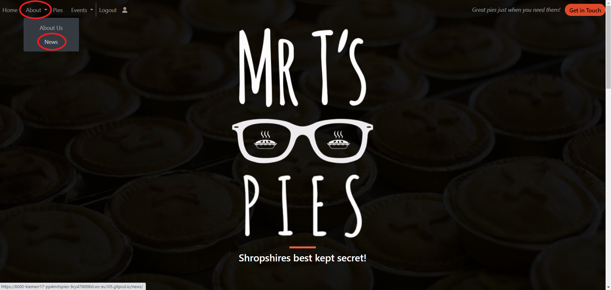

13. As a User i can Create Read and Delete my comments on articles so that i can connect with the site owner

**Step** | **Expected Result** | **Actual Result**
------------ | ------------ | ------------ |
| Read a comment - From the home page, navigate to 'About' drop down then click 'News'. Click 'read more' on the article you want to find out more from or leave a comment. Scroll to the bottom of the page to the section where you can leave a comment. | A display of comments left by users on that article to be shown | Worked as expected |
| Create a comment - (must be logged in) write your words in the box on the article detail, click 'add comment'. | The users comment to be added to the list of comments | Worked as expected |
| Delete a comment - Click the red trash can next to your comment | A notification to confirm deletion of the comment to pop up next to the comment. If confirmed, comment deleted, if not then the notification to be hidden | Worked as expected |

Instructions

Read Comments

Create Comment

Delete a comment

15. As a User i can not book an event in the past so that my booking remains valid

**Step** | **Expected Result** | **Actual Result**
------------ | ------------ | ------------ |
| Navigate to the 'Events' drop down then click 'Workshops'. | All current workshops displayed are all Future dates | Worked as expected |

Instructions

16. As a User i can view news articles page-by-page so that the screen isn't crowded with information

**Step** | **Expected Result** | **Actual Result**
------------ | ------------ | ------------ |
| From the home page, navigate to 'About' drop down then click 'News'. Click 'Next' to see more articles. | Articles to be paginated and displaying x3 per page | Worked as expected |

Instructions

28. As a User i can View a list of events so that I can choose which one i want to book onto

**Step** | **Expected Result** | **Actual Result**
------------ | ------------ | ------------ |
| From the home page, navigate to 'Events' then to 'Workshops | A list of all workshops to be displayed for you to browse and book at your leisure | Worked as expected |

Instructions

29. As a User i can hide past events so that I can NOT book an event in the past

**Step** | **Expected Result** | **Actual Result**
------------ | ------------ | ------------ |
| Navigate to the 'Events' drop down then click 'Workshops'. | All current workshops displayed are all Future dates | Worked as expected |

Instructions

31. As a User i can view events in pages so that the screen doesn't get blocked up with too many events

**Step** | **Expected Result** | **Actual Result**
------------ | ------------ | ------------ |
| Navigate to the 'Events' drop down then click 'Workshops'. Click 'Next' to see more available workhops | See that the workshops are paginated, displaying x4 per page | Worked as expected |

Instructions

17. As a Admin i can login so that i can access the back end of the site

**Step** | **Expected Result** | **Actual Result**
------------ | ------------ | ------------ |
| In the address bar, navigate to 'mrtspies.herokuapp.com/admin. Login with your Admin login details | Be shown the Admin panel where you can make changes to Admin areas | Worked as expected |

Instructions

18. As a Admin i can manually add a booking so that people can book onto an event in other ways

**Step** | **Expected Result** | **Actual Result**
------------ | ------------ | ------------ |
| From the Admin panel, scroll down and select 'add' next to Booking. Enter the Users details, select which workshop the booking is for, also if any special dietary requirements are needed and check if the Approved status needs to be yes or no. Click Save  | Booking for selected workshop to be successfully added | Worked as expected |

Instructions

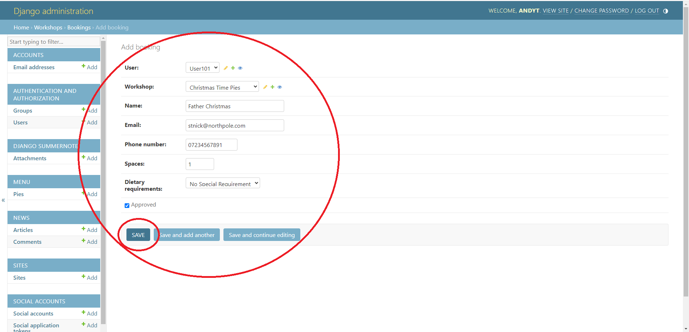

19. As a Admin i can accept or reject booking so that we avoid false bookings

**Step** | **Expected Result** | **Actual Result**
------------ | ------------ | ------------ |
| From the Admin panel scroll down and select 'Bookings'. Click the user name for the booking you want to change. Bookings default to 'not approved'. Click to either approve and save the booking or delete the booking | Changes made to the booking to be reflected in the Admin panel 'Bookings' section | Worked as expected |

Instructions

23. As a Admin i can filter events by date so that I can see what events we have for a particular day

**Step** | **Expected Result** | **Actual Result**
------------ | ------------ | ------------ |
| Scroll down on the Admin panel and select 'Workshops'. On the right hand side there is an option to filter the Workshops by many things, select which one you would like to filter them by. You can choose to clear the filter once it has been applied | Workshops to be filtered depending on which option is selected | Worked as expected |

Instructions

27. As a Site Admin i can create, update and delete events so that users can book onto them

**Step** | **Expected Result** | **Actual Result**
------------ | ------------ | ------------ |
| Create an event - Scroll down to the section 'Workshops' and click 'Add'. Input the relevent details, choose if the workshop is publised or draft and click 'Save'  | Workshop to be created and if 'published', displayed to users for booking | Worked as expected |
| Update an event - Scroll down to the section 'Workshops' and click 'Workshops. Click on the enent you wish to make the changes to. Make adjustments before scrolling down, and clicking save. | Changes made to the even to be update on the workshop | Worked as expected |
| Delete an event - Scroll down to the section 'Workshops' and click 'Workshops. Click on the event you wish to delete. Scroll to the bottom of that page and click 'delete'. Then confirm your deletion. | Event to be deleted and removed from the list of workshops | Worked as expected |

Instructions

Create an event

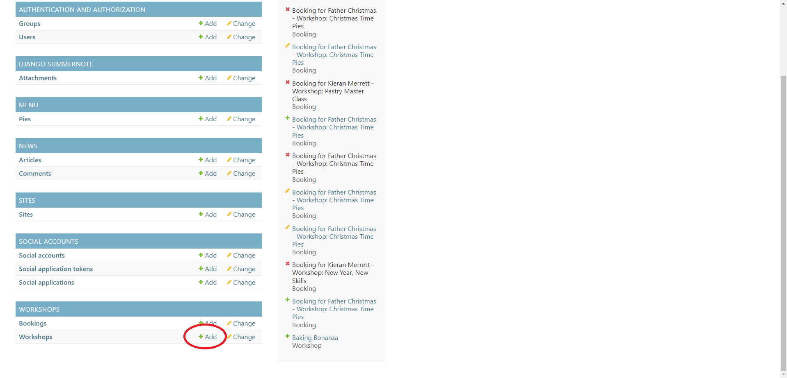

Update an event

Delete an event

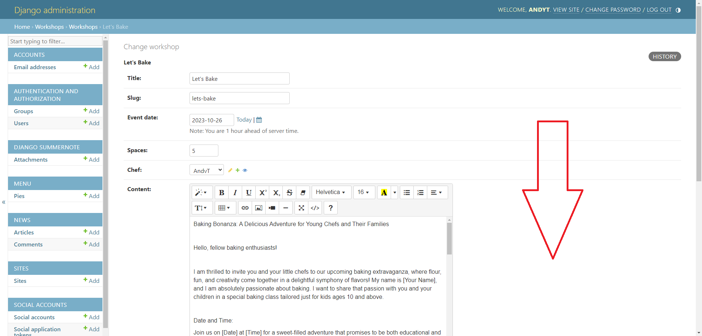

24. As a Site Owner i can provide a fully responsive site for my customers so that they have a good user experience

**Step** | **Expected Result** | **Actual Result**
------------ | ------------ | ------------ |
| Open the webpage on google chrome, right click and select 'inspect'. Test all screen sizes by changing the preset values. | All content to be readable and scales dependant on viewing platform. | Worked as expected |

Instructions

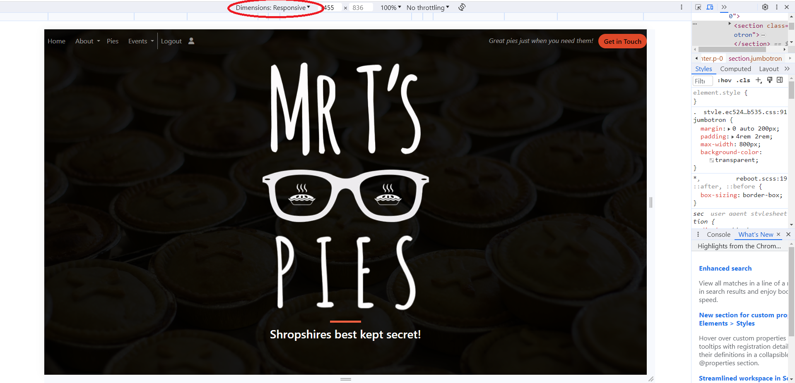

25. As a Site Owner i can validate data entered into my site so that all submitted data is correct to avoid errors

**Step** | **Expected Result** | **Actual Result**
------------ | ------------ | ------------ |
| Go to book onto an event, enter incorrect/missing data. | Be notified of the incorrect data | Worked as expected |
| Create a comment - (must be logged in) submit an empty box by clicking 'add comment'. | Be notified of incorrect data | Worked as expected |
| Navigate to the get in touch section, attempt to submit empty form and/or incorrect/missing data | Be notified of incorrect data | Worked as expected |

Instructions

Invalid booking

Empty Comment Error

Get in touch valid data

26. As a Site Owner i can provide a contact us page so that users can get in touch with the business

**Step** | **Expected Result** | **Actual Result**
------------ | ------------ | ------------ |
| Navigate to the 'Get in Touch' button on the home screen. | Be presented with a form to contact the business and also some alternative methods of contact | Worked as expected |

Instructions

### Automated testing

- Testing was done using the built in Django module, unittest.

All tests

Menu App

test_models.py

test_views.py

test_urls.py

News App

test_models.py

test_views.py

test_urls.py

Workshop App

test_models.py

test_views.py

test_urls.py

## Bugs

| **Bug** | **Fix** |
| ------- | ------- |
| Booking form error when submitting a new booking | Minor indentation error when flowing through code. |
| Empty Contact form submitting | Added a 'required' field to the text box area |

##### Back to [top](#table-of-contents)

### Heroku Deployment
This application has been deployed from GitHub to Heroku by following the steps: 
(non project specific deployment process images used)

Steps

 
First Enter the following into Github Terminal to get the requirements for heroku.
'pip3 freeze > requirements.txt'

 
Once you have your requirements generated, save and push the changes to github.

 
Go to Heroku and Sign up or Login

 

 
On the right click new and create new app

 
Enter an app name and select your area then click create

 
First go to the settings tab

 
Click reveal config vars

 
In this box type 'CREDS'

 
Head over to your project and to the creds.json file, copy its contents over to the value box.

 
Copy into the value box and click 'add'

 
Add the buildpacks in the correct order with Python first and Nodejs 2nd

 
Head back over to the deploy tab

 
Connect to your Github Account and search your project name

 
Click 'connect' to link your project

 
First select which branch you wish to deploy, then either auto deploy or manual. 
Auto means each time you push changes Heroku will automatically update the app.
Manual means YOU have to update yourself

 
Your app is being built

 
Click to view completed app

### Fork Repository
To fork the repository by following these steps:
1. Go to the GitHub repository
2. Click on Fork button in upper right hand corner

### Clone Repository
You can clone the repository by following these steps:
1. Go to the GitHub repository 
2. Locate the Code button above the list of files and click it 
3. Select if you prefere to clone using HTTPS, SSH, or Github CLI and click the copy button to copy the URL to your clipboard
4. Open Git Bash
5. Change the current working directory to the one where you want the cloned directory
6. Type git clone and paste the URL from the clipboard ($ git clone https://github.com/YOUR-USERNAME/YOUR-REPOSITORY)
7. Press Enter to create your local clone.

##### Back to [top](#table-of-contents)

## Credits

### Images

Images used were sourced from Pexels.com and provided by Mr T's Pies

### Code

- I have used code where needed from Bootstrap: https://getbootstrap.com/docs/4.0/getting-started/introduction/

- I have used different elements to display all of the news articles and the workshops from examples on https://www.tutorialrepublic.com/snippets/gallery.php?tag=carousel

##### Back to [top](#table-of-contents)

## Acknowledgements

### Special thanks to the following:
- Code Institute
- My Mentor Mo Shami
